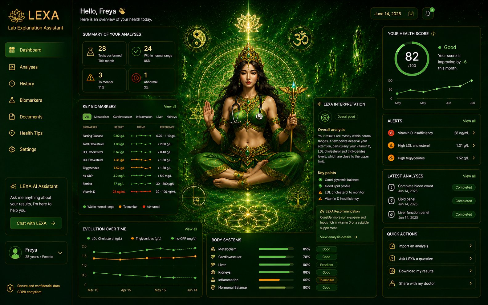

<div align="center">


# LEXA — Lab EXplanation Assistant

**A retrieval‑grounded clinical decision‑support chatbot that runs 100% offline on your own machine.**

It answers *only* from a vetted knowledge base, **cites every claim**, refuses to guess,
talks and listens out loud, and ships as a single‑file Windows desktop app.

`Python` · `FastAPI` · `NumPy` · `RAG` · `Offline Speech (Vosk)` · `Local LLM (Ollama)` · `PyInstaller`

</div>

---

## ✨ What it does

LEXA is a privacy‑first medical assistant. Every answer is built **from an embedded,
labelled corpus** and carries a source citation — if a question isn't covered, LEXA says so
instead of hallucinating. It also chats naturally, reads answers aloud, and wakes to its name —
all without an internet connection.

> ⚠️ **Not a medical device.** The corpus is fictional and labelled as such. This is a
> portfolio / educational project, not real clinical guidance.

---

## 🧠 Highlights

- **Retrieval‑augmented, grounded answers** — a from‑scratch embedder (MD5 feature‑hashing,
  L2‑normalised, IDF‑weighted) retrieves relevant chunks; answers are assembled *only* from
  what was retrieved.
- **Safety guardrails baked into the pipeline**
  - Below the similarity threshold → *"not in the knowledge base"* (never guesses).
  - Every non‑refusal answer must carry **≥ 1 valid citation** — an output guard blocks
    uncited or mis‑cited answers.
  - Refuses **diagnosis** and **patient‑specific dose calculation** (general formulary
    lookups are allowed).
  - Routes **emergencies** to emergency services; appends a clinical disclaimer.
  - Every Q&A is **audited** to a JSONL trail.
- **Offline voice** — wake word *"Lexa"*, speech‑to‑text via **Vosk** (server‑side, fully
  offline), and text‑to‑speech via the OS voices. No cloud, no audio leaves the machine.
- **Free‑form conversation** — a **local LLM via Ollama** handles general chat (separate,
  non‑clinical lane), so LEXA can talk about anything while the medical path stays grounded.
- **Single‑file architecture** — the whole app (API + 3 web pages embedded as strings) lives
  in one `medassist_app.py`; core dependencies are just **FastAPI + uvicorn + NumPy**.
- **Ships as a desktop app** — packaged into a standalone Windows `.exe` (PyInstaller +
  pywebview / WebView2), with sign‑in, a chat page, and a dashboard.

---

## 🖼️ Screenshots

| Chat (grounded answer + sources) | Dashboard |
|---|---|
| _add `docs/chat.png`_ |  |

> Tip: drop a couple of screenshots in a `docs/` folder and update the links above.

---

## 🏗️ How it works

```
            ┌─────────────┐   ┌──────────────┐   ┌────────────┐   ┌──────────────┐   ┌───────┐
  query ──▶ │ input guard │──▶│  chitchat /  │──▶│ retrieval  │──▶│  synthesis   │──▶│ output│──▶ answer
            │ (emergency, │   │ conversation │   │ (embed +   │   │ (extractive/ │   │ guard │   (+ cites,
            │ dose, dx)   │   │  short‑circuit)│  │  cosine)   │   │  cited)      │   │ +audit│   disclaimer)
            └─────────────┘   └──────────────┘   └────────────┘   └──────────────┘   └───────┘
```

- **Embedder:** unsigned MD5 feature hashing (not Python's salted `hash()`), stop‑word +
  min‑length filtering, dim 4096, cosine similarity, threshold ≈ 0.12.
- **Conversation lane:** instant scripted small‑talk **+** a local Ollama model — neither
  carries citations; medical claims always go through retrieval → citation → output guard.

---

## 🚀 Run it (offline, no API key)

```bash
pip install fastapi "uvicorn[standard]" numpy
python medassist_app.py
# open http://127.0.0.1:8000  → sign in
```

**Demo login:** `Freya` / `lexa-demo`  *(override with `ADMIN_USERNAME` / `ADMIN_PASSWORD`)*

Try it:
- `first line treatment for hypertension` → answered **with source chips**
- `what is the adult paracetamol dose` → allowed · `how much paracetamol for my 4yo` → blocked
- `patient has chest pain` → emergency · `fix a diesel turbocharger` → *"not in the knowledge base"*
- say **"Lexa"** to wake her; ask *"who created you?"*; have a normal chat.

### Optional extras
- **Offline voice (STT):** download a [Vosk model](https://alphacephei.com/vosk/models)
  (e.g. `vosk-model-small-en-us-0.15`), unzip it as `vosk-model/` in the project root.
- **Free‑form conversation:** install [Ollama](https://ollama.com), then `ollama pull llama3`
  (the app auto‑detects it; falls back to scripted chat if absent).

### Build the desktop app
```bash
pip install pyinstaller pywebview
python -m PyInstaller --noconfirm --onefile --windowed --name MedAssist --icon app.ico \
  --add-data "dash_bg.jpg;." --add-data "avatar.png;." --add-data "dash_page.jpg;." \
  --add-data "logo.png;." --add-data "vosk-model;vosk-model" \
  --collect-all webview --collect-all vosk --collect-submodules uvicorn \
  --collect-all websockets medassist_app.py
# → dist/MedAssist.exe
```

---

## 🧰 Tech stack

**Backend/core:** Python · FastAPI · uvicorn · NumPy
**RAG:** custom feature‑hashing embedder + cosine retrieval (no heavyweight ML deps)
**Voice:** Vosk (offline STT) · Web Speech `speechSynthesis` (TTS) · Web Audio streaming over WebSocket
**Conversation LLM:** Ollama (local, offline) — e.g. Llama 3 8B
**Packaging:** PyInstaller (one‑file) + pywebview (WebView2 native window)
**No SDKs** — optional cloud LLM providers are called via stdlib `urllib`.

---

## 📁 Project structure

```
medassist_app.py     # the entire app: API + login/chat/dashboard pages + RAG + guards + voice
app.ico              # window/taskbar icon
*.png / *.jpg        # UI assets (avatar, wallpaper, logo, dashboard)
BUILD.md             # build/spec notes
CLAUDE.md            # engineering notes & invariants
```
*(The `.exe`, `vosk-model/`, and audit logs are intentionally git‑ignored — see `.gitignore`.)*

---

## 👩‍💻 Author

Built by **Freya — Elodie** as a portfolio project exploring grounded, safe, offline
clinical AI. Not affiliated with any medical organisation; not for clinical use.
